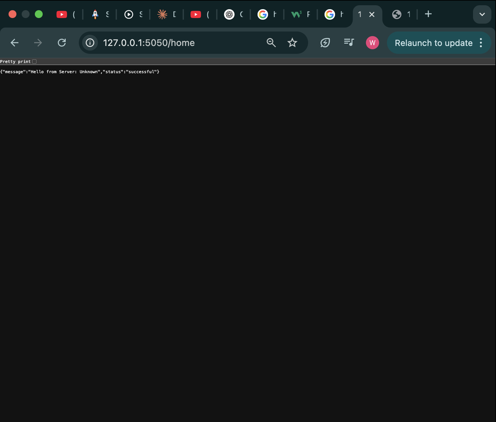

# Customized Load Balancer 

This project involves the creation of a Customized Load Balancer designed for distributed systems. It demonstrates key concepts including:
- A Dockerized HTTP server written with Flask
- A consistent hashing module to distribute requests
- Early testing and screenshots
- Port considerations due to system-level conflicts 

---

##  Flask Server

### Features
- `/home` endpoint returns a JSON message with a unique server ID.
- `/heartbeat` endpoint confirms the server is alive with HTTP 200.

### Code
Server is implemented in `server.py`. Example response from `/home`:

```json
{
  "message": "Hello from Server: Unknown",
  "status": "successful"
}
```

> Server ID is passed via an environment variable (`SERVER_ID`) when running the container.

---

## Dockerfile

The Flask server is containerized using the following Dockerfile:

```dockerfile
FROM python:3.9-slim
WORKDIR /app
COPY server/server.py .
RUN pip install flask
ENV SERVER_ID=1
CMD ["python", "server.py"]
```

---

## Port Usage

For local development, we used **port `5050`** :
```python
app.run(host='0.0.0.0', port=5050)
```

This will be reverted to `5000` before final testing in Ubuntu.

---

## Screenshots

### `/home` endpoint


### `/heartbeat` endpoint


---

##  Consistent Hashing

Implemented in `hashing/consistent_hash.py`. Features:
- 512-slot consistent hash ring
- Each physical server has 9 virtual replicas
- Hashing functions as specified in the assignment:
  - Request: `H(i) = i + 2^i + 17`
  - Virtual server: `Φ(i, j) = i + j + 2^j + 25`
- Exponentiation is capped to prevent overflow:
  ```python
  def _hash_request(self, i):
      return (i + (2 ** (i % 10)) + 17) % 512
  ```

---

## 📂 Repository Structure (so far)
```
Customized_Load_Balancer/
│
├── load_balancer/
│   ├── load_balancer.py        
│   ├── consistent_hash.py      
│   ├── test_hashing.py         
│   ├── venv/                   
│   └── __init__.py             
│
├── server/
│   ├── server.py               
│   ├── Dockerfile              
│
├── test/
│   ├── async_client_test.py    
│   └── plot_results.py         
│
├── docker-compose.yml          
├── README.md                   
├── requirements.txt            
└── .gitignore                  

```

---
