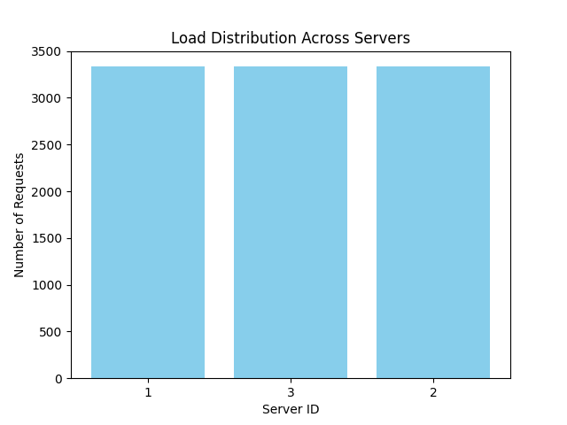
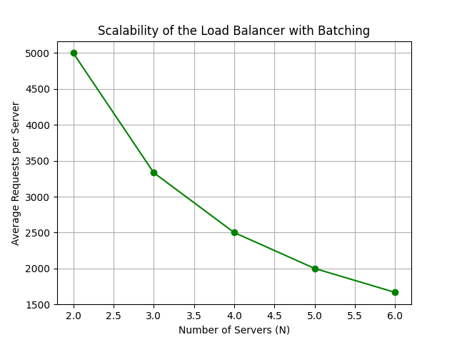

# Distributed Load Balancer with Consistent Hashing

> **For Interviews**: This project demonstrates advanced distributed systems concepts including consistent hashing, microservices architecture, Docker containerization, and performance analysis.

A production-ready load balancer implementation that efficiently distributes client requests across multiple server replicas using consistent hashing. Built as part of **ICS 4104: Distributed Systems** coursework.

## 🏗️ **Architecture Overview**

```
Client Requests → Load Balancer (Consistent Hashing) → Server Pool (Docker Containers)
                       ↓
                 Automatic Failure Recovery & Scaling
```

**Key Components:**
- **Load Balancer** (`load_balancer.py`): Core routing logic with RESTful API
- **Consistent Hash Ring** (`consistent_hash.py`): Efficient request distribution
- **Server Pool** (`server.py`): Containerized Flask microservices
- **Performance Testing** (`test/`): Async load testing and analysis

---

## 🚀 **Technical Highlights**

### **1. Consistent Hashing Implementation**
- **512-slot hash ring** with **9 virtual servers per physical server**
- **Quadratic probing** for collision resolution
- **O(log N) lookup time** using bisect algorithm
- **Custom hash functions**:
  - Request mapping: `H(i) = i + 2^i + 17`
  - Virtual server mapping: `Φ(i, j) = i + j + 2^j + 25`

```python
def get_server(self, request_id):
    slot = self._hash_request(request_id)
    idx = bisect.bisect_left(self.sorted_keys, slot)
    if idx == len(self.sorted_keys):
        idx = 0
    return self.ring[self.sorted_keys[idx]]
```

### **2. Microservices & Containerization**
- **Dockerized Flask servers** with health monitoring
- **Container lifecycle management** (spawn/remove on demand)
- **Service discovery** via Docker networking
- **Environment-based configuration**

### **3. RESTful Load Balancer API**
| Endpoint | Method | Purpose |
|----------|---------|----------|
| `/rep` | GET | Get replica status |
| `/add` | POST | Scale up servers |
| `/rm` | DELETE | Scale down servers |
| `/<path>` | GET | Route requests to servers |

## 🔌 **API Examples**

### **Get Replica Status**
```bash
curl http://localhost:5000/rep
```
```json
{
  "message": {
    "N": 3,
    "replicas": ["Server1", "Server2", "Server3"]
  },
  "status": "successful"
}
```

### **Add New Servers**
```bash
curl -X POST http://localhost:5000/add \
  -H "Content-Type: application/json" \
  -d '{"n": 2, "hostnames": ["Server4", "Server5"]}'
```
```json
{
  "message": {
    "N": 5,
    "replicas": ["Server1", "Server2", "Server3", "Server4", "Server5"]
  },
  "status": "successful"
}
```

### **Remove Servers**
```bash
curl -X DELETE http://localhost:5000/rm \
  -H "Content-Type: application/json" \
  -d '{"n": 1, "hostnames": ["Server4"]}'
```
```json
{
  "message": {
    "N": 4,
    "replicas": ["Server1", "Server2", "Server3", "Server5"]
  },
  "status": "successful"
}
```

### **Route Request to Server**
```bash
curl http://localhost:5000/home
```
```json
{
  "message": "Hello from Server: 2",
  "status": "successful"
}
```

### **Error Handling**
```bash
curl -X POST http://localhost:5000/add \
  -H "Content-Type: application/json" \
  -d '{"n": 1, "hostnames": ["S1", "S2", "S3"]}'
```
```json
{
  "message": "<Error> Length of hostname list is more than newly added instances",
  "status": "failure"
}
```

---

## 🔧 **Quick Start**

```bash
# Build and deploy the entire stack
make build
make run

# Test the load balancer
curl http://localhost:5000/rep
curl http://localhost:5000/home
```

### **Container Management**
```bash
# Add 2 new servers
curl -X POST http://localhost:5000/add \
  -d '{"n": 2, "hostnames": ["server4", "server5"]}'

# Remove servers
curl -X DELETE http://localhost:5000/rm \
  -d '{"n": 1, "hostnames": ["server4"]}'
```

---

## 📊 **Performance Analysis**

### **Load Distribution Test**
- **10,000 async requests** across N=3 servers
- **Nearly perfect load balancing** achieved through consistent hashing
- **Automatic failure recovery** with minimal request loss



### **Scalability Analysis**
- Tested scaling from **N=2 to N=6 servers**
- **Linear performance improvement** with server addition
- **Consistent average load** across all server configurations



---

## 🛠️ **Technical Implementation Details**

### **Consistent Hashing Algorithm**
```python
class ConsistentHashMap:
    def __init__(self, num_slots=512, virtual_servers=9):
        self.M = num_slots  # Total slots in ring
        self.K = virtual_servers  # Virtual replicas per server
        self.ring = dict()  # slot -> server_id mapping
        self.sorted_keys = []  # Sorted slot positions
```

### **Docker Integration**
```python
def spawn_container(server_id, hostname=None):
    subprocess.run([
        "docker", "run", "--rm", "-d",
        "--name", hostname,
        "--network", "net1",
        "-e", f"SERVER_ID={server_id}",
        "server_img"
    ])
```

### **Thread-Safe Operations**
- **Locks for round-robin state** management
- **Concurrent request handling**
- **Safe container lifecycle operations**

---

## 🎯 **Interview Discussion Points**

### **Distributed Systems Concepts**
1. **Why consistent hashing?** - Minimizes data movement during scaling
2. **Virtual servers benefit** - Better load distribution and fault tolerance
3. **Hash collision handling** - Quadratic probing vs linear probing trade-offs
4. **Failure recovery strategy** - Automatic container spawning and health checks

### **System Design Decisions**
1. **Docker vs VM trade-offs** - Resource efficiency and isolation
2. **API design patterns** - RESTful endpoints and error handling
3. **Performance optimization** - Bisect algorithm for O(log N) lookups
4. **Monitoring and observability** - Health checks and metrics collection

### **Scalability & Reliability**
1. **Horizontal scaling approach** - Adding/removing servers dynamically
2. **Load balancing algorithms** - Consistent hashing vs round-robin
3. **Failure modes and recovery** - Container crashes and network partitions
4. **Performance under load** - Async request handling and bottlenecks

---

## 📁 **Project Structure**
```
├── load_balancer/
│   ├── load_balancer.py      # Main load balancer logic
│   └── consistent_hash.py    # Hash ring implementation
├── server/
│   └── server.py            # Flask microservice
├── test/
│   ├── async_client_test.py # Performance testing
│   └── plot_results.py      # Results visualization
├── docker-compose.yml       # Container orchestration
└── Makefile                # Build automation
```

---

## 🔍 **Key Learnings**

- **Consistent hashing** provides excellent load distribution with minimal reshuffling
- **Virtual servers** significantly improve fault tolerance in hash rings
- **Docker networking** enables seamless service discovery and communication
- **Performance testing** is crucial for validating distributed system behavior

---

**Built with**: Python, Flask, Docker, Docker Compose  
**Assignment**: ICS 4104 Distributed Systems  
**Focus**: Load balancing, consistent hashing, containerization, performance analysis
